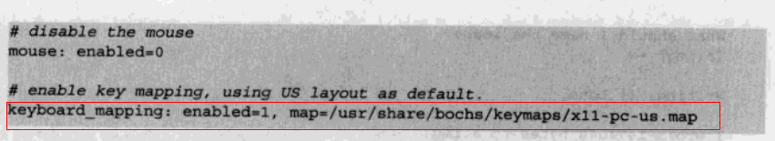

# SevenOS

## **1 **项目背景

### **1.1** **项目目的**

该项目为同济大学软件学院2020年操作系统课程设计项目。

操作系统是软件专业的一门必修课，经过一学期的学习，我们基本了解和掌握了操作系统各个部分的基础知识和工作原理，但依然停留在理论环节，缺少实践来检验、巩固我们所学的内容，加深对操作系统的理解。操作系统课程设计的目的就是让我们自己学习、动手实现一个简单但功能完善的操作系统，让我们从零开始实现这样的一个操作系统。

### **1.2** **项目简介**

本项目以 Oranges’操作系统作为基本框架，完成了 2 个B级难度应用: 进程管理和文件管理，文件系统新增代码量到达文件模块的一半，可以针对文件/目录进行增删改写操作，同时实现了多级目录，可在不同层级目录中进行转换；可以模拟实现进程创建与删除，进程占用资源、死锁，以及多种进程调度算法；完成了 1 个C级系统级应用——控制台；同时，还实现了 7 个D级用户级应用，包括计算器、日历、秒表和 4 个小游戏（推箱子、迷宫、扫雷、数独）。系统将根据输入的命令进行不同的操作。

此外，项目还有许多附加的小功能，例如开机动画和清屏等。

### **1.3** **项目配置**

- ​	编写语言：汇编语言，C语言
- ​	开发环境：基于32位Ubuntu开源GNU/Linux操作系统	
- ​	运行环境：windows/macOS下的VMWare，使用bochs模拟器</u>

### **1.4** **项目分工**

| 项目成员 | 实现功能                                                 |
| -------- | -------------------------------------------------------- |
| 夏哲辉   | 进程调度算法、秒表功能                                   |
| 闫沐西   | 进程创建与删除，进程申请、释放资源，死锁处理模拟，数独。 |
| 董震宇   | 文件系统、命令行功能实现、计算器和开机动画               |
| 龚    攀 | 日历、扫雷游戏实现                                       |
| 陈永顺   | 推箱子、迷宫游戏实现                                     |


## 2 环境配置(简易版本)

:bangbang:需要再Linux环境下编译运行

1. 在Linux环境下安装Bochs

   在安装之前，请先下载以下四个插件：

   ```
   sudo apt-get install build-essential
   sudo apt-get install xorg-dev
   sudo apt-get install bison
   sudo apt-get install libgtk2.0-dev
   ```

2. 到Bochs官网下载**2.6及以上**版本

3. ```
   tar vxzf bochs-版本号.tar.gz
   cd bochs-2.6.5
   ./config --enable-debugger --enabele-disasm
   make
   sudo make install
   ```

   如果这里出现以下报错：

   ```
   /usr/bin/ld: gui  undefined reference to symbol 'pthread_create@@GLIBC_2.1'
   collect2: error: ld returned 1 exit status
   make: *** [bochs] Error 1
   ```

   解决方法：

   打开Makefile，在92行左右找到 LIBS ＝ ......一行，在这一行最后面添加 –lpthread

4. 创建软盘映像

   ```
   bximage
   ```

   然后选择1.44，命名你的软盘映像(a.img)

5. 将软盘写入扇区

   ```
   dd if=boot.bin of=a.img bs=512 count=1 conv=notrunc
   ```

6. 新建一个配置文件，如下（或者自行在网上下载，或者用光盘里的配置文件，但要注意以下这三个地方跟你的计算机是否对应）：

   

   

7. 然后输入`bochs -f bochsrc `即可


## 3 **操作说明**

### 3.1 **开机动画**

修改`bochsrc`文件中的工作路径后，在终端运行bochs，回车后输入'c'，即可进入系统。


### 3.2 **界面及命令行**

#### 3.2.1 主界面

控制台界面也是帮助界面，显示所有功能的命令及概要介绍。输入各命令即可进入相应功能界面。若想回到主界面（help界面），在命令行中输入**help**即可。


#### 3.2.2 帮助界面

在命令行中输入 more XXX 即可进入对应的帮助界面，对该功能进行详细介绍。

##### 3.2.2.1 more help


##### 3.2.2.2 more clear


##### 3.2.2.3 more game


##### 3.2.2.4 more math


##### 3.2.2.5 more file

\

#### 3.2.3 命令不存在


### 3.3 **文件系统**

文件系统实现了基本的文件操作，并设置根目录为home。文件系统所保存的文件可以永久保存在硬盘80m.img中。

#### 3.3.1 进入文件系统


#### 3.3.2 创建文件（.txt文件）

命令：create 文件名


#### 3.3.3 创建文件夹

命令：mkdir 文件夹名


#### 3.3.4 显示当前目录全部文件

命令：ls


#### 3.3.5 进入下一级文件夹

命令：cd 文件夹名


错误测试：不可以使用`cd`命令进入文本文件，会输出相应提示：


#### 3.3.6 返回上一级

命令：cd..


#### 3.3.7 删除文件/文件夹

命令：rm 文件名/文件夹名


#### 3.3.8 读取文本文件

命令：read 文件名


错误测试：不可以使用`read`命令读取文件夹，会输出相应提示：


#### 3.3.9 编辑文本文件

命令：edit 文件名


错误测试：不可以使用`edit`命令读取文件夹，会输出相应提示：


#### 3.3.10 保存到磁盘

命令：save


在退出时，为了防止用户忘记执行save指令，会进行退出系统的提示：


### 3.4 **进程管理**

####  3.4.1 进程调度算法

  根据《Orange’s 一个操作系统的实现》书中进程调度模块阐述的原理，基于源代码进行修改，在原有基础上进行改进，模拟实现了先到先服务算法、时间片轮转算法、最短作业优先算法、多级队列调度算法。

-   先到先服务算法：设置ticks为进程运行总时间，enter_time模拟进入时间，最早进入的先执行。所有进程ticks减为0终止。


-   时间片轮转算法：设置相同ticks，即模拟相同大小时间片，时间片运行完切换进程，循环无限轮转。


-   最短作业优先算法：设置ticks为进程运行总时间，ticks最小者优先运行。所有进程ticks减为0终止。


-   多级队列算法：设置priority为进程优先级，即对应队列时间片的大小。keep为各进程运行总时间。各进程运行完各自队列的时间片切换进程，循环往复直到所有进程keep减为0终止。


#### 3.4.2 进程的创建与杀死

抢占式的多级队列调度算法：

为了检验与应用进程创建与杀死的方法，选择实现一个抢占式的调度算法，orange原本就有一个全局变量ticks记录系统中断的次数，设定当ticks为某数的倍数时，自动创建或杀死一个进程，直到所有进程都执行完为止，运行截图如下：


当创建一个进程时，会有create： xx的字样代表创建进程的进程在运行，杀死一个进程时，会有Remove： xx的字样表示杀死进程的进程在运行，最终所有进程都运行完毕，输出END字样。

#### 3.4.3 进程的资源申请、释放模拟

实现三个系统调用apply，print，release表示申请、显示、释放资源，另有一个粗浅判断死锁的dead_lock函数，若申请资源后当前有资源被占用且所有程序无法释放资源时，为死锁状态。运行截图如下：


如图所示，程序每申请一个资源，就在屏幕上显示该资源。

### 3.5 **用户级应用——计算器**

#### 3.5.1 计算表达式的值

命令：math 表达式


#### 3.5.2 输出后缀表达式

命令：math -rev 表达式


#### 3.5.3 格式统一

命令：math -beauty 表达式


#### 3.5.4 非法判断

##### 3.5.4.1 表达式有特殊符号


##### 3.5.4.2 括号不匹配


### 3.6 **用户级应用——秒表**

用户输入watch指令，运行秒表功能。秒表每秒输出一次当前秒数，每十秒输出一次"Count 10 seconds."


### **3.7 用户级应用——推箱子**

用户输入“game -box”进入推箱子游戏画面；首先系统打印地图，然后用户通过输入wasd来对小人进行移动，直至所有箱子已经推完，用户中途可以输入q直接退出游戏界面。


### 3.8 **用户级应用——迷宫**

用户输入“game -maze"指令，进入迷宫小游戏界面，首先打印迷宫地图，然后用户通过输入wasd进行人物的移动，直到到达终点，用户中途可以输入q直接退出游戏。


### 3.9 **用户级应用——扫雷**

用户输入“game -saolei”指令，即可进入扫雷游戏界面；由Print_Interface()打印初始界面，用户通过输入一个坐标来掀开该地，会显示空地或附近的雷数量，直到扫除所有雷，或掀开一个地方有雷，游戏结束；用户也可输入“q”结束游戏。


### 3.10 **用户级应用——数独**

- 命令：game -sudoku


- 获取答案，获取提示，错误提示：


- 填数字，重新开始：


## 4. **功能实现**

### 4.1 **文件系统**

1. 代码：fs/FileSystem.c
2. 实现：文件系统利用Oranges’代码样例中给出的open(),write(),read()函数进行硬盘读写的模拟操作，将界面上各种文件控制操作和对应文件记录记录在80.img硬盘上。实现了Orange's没有的多级文件系统和文件记忆功能。

3. 主要函数：

| 函数名称             | 参数及类型                               | 说明                 |
| -------------------- | ---------------------------------------- | -------------------- |
| void FSInit()        | 无                                       | 初始化文件块结构体   |
| void FSCommand()     | 无                                       | 文件系统命令集       |
| void initFileBlock() | int fileID, char* fileName, int fileType | 初始化文件块         |
| void toString()      | char* temp, int i                        | int转换为string      |
| int toInt()          | char* temp                               | string转换为int      |
| void WriteDisk()     | int len                                  | 写出到硬盘的虚拟文件 |
| int ReadDisk()       | 无                                       | 读取硬盘虚拟文件     |
| int createFile()     | char* fileName, int fileType             | 创建文件             |
| void showFile()      | 无                                       | 显示当前目录文件     |
| int searchFile()     | char* name                               | 查找文件             |
| void returnFile()    | int ID                                   | 返回上一层           |
| void deleteFile()    | int ID                                   | 删除文件             |
| void FSManage()      | int fd_stdin                             | 文件系统主函数       |

4. 核心代码

写入磁盘：void WriteDisk()

```c
void WriteDisk(int len)
{
    char temp[MAX_FILE_NUM * 150 + 103];
    int i = 0;
    temp[i] = '^';
    i++;
    toString(temp + i, fileIDCount);
    i = i + 3;
    temp[i] = '^';
    i++;
    for (int j = 0; j < MAX_FILE_NUM; j++) 
    {
        if (IDLog[j] == 1) 
        {
            toString(temp + i, files[j].fileID);
            i = i + 3;
            temp[i] = '^';
            i++;
            for (int h = 0; h < strlen(files[j].fileName); h++) 
            {
                temp[i + h] = files[j].fileName[h];
                if (files[j].fileName[h] == '^')
                {
                    temp[i + h] = (char)1;
                }
            }
            i = i + strlen(files[j].fileName);
            temp[i] = '^';
            i++;
            temp[i] = (char)(files[j].fileType + 48);
            i++;
            temp[i] = '^';
            i++;
            for (int h = 0; h < strlen(files[j].content); h++) 
            {
                temp[i + h] = files[j].content[h];
                if (files[j].content[h] == '^')
                {
                    temp[i + h] = (char)1;
                }
            }
            i = i + strlen(files[j].content);
            temp[i] = '^';
            i++;
            toString(temp + i, files[j].fatherID);
            i = i + 3;
            temp[i] = '^';
            i++;
            for (int m = 0; m < MAX_FILE_PER_LAYER; m++) 
            {
                toString(temp + i, files[j].children[m]);
                i = i + 3;
            }
            temp[i] = '^';
            i++;
            toString(temp + i, files[j].childrenNumber);
            i = i + 3;
            temp[i] = '^';
            i++;
        }
    }
    int fd = 0;
    int length = 0;
    fd = open("ss", O_RDWR);
    assert(fd != -1);
    length = write(fd, temp, strlen(temp));
    assert(length == strlen(temp));
    close(fd);
}
```


读取磁盘：int ReadDisk()

```c
int ReadDisk() 
{
    char readbuf[1000];//读入内容的缓冲区
    int fd = 0;// file descriptor文件描述符 
    int length = 0;
    fd = open("ss", O_RDWR);//可读可写
    assert(fd != -1);
    length = read(fd, readbuf, 1000);//读fd指的内容到readbuf中，最多读1000bytes
    assert(length == 1000);
    readbuf[length] = 0;
    int r = 1;
    fileIDCount = toInt(readbuf + r);
    r = r + 4;
    for (int i = 0; i < fileIDCount; i++) 
    {
        int ID = toInt(readbuf + r);
        IDLog[ID] = 1;
        files[ID].fileID = ID;
        r = r + 4;
        for (int i = 0; i < MAX_FILE_NAME_LENGTH; i++) 
        {
            if (readbuf[r] == '^')
                break;
            else if (readbuf[r] == (char)1)
                files[ID].fileName[i] = '^';
            else
                files[ID].fileName[i] = readbuf[r];
            r++;
        }
        r++;
        files[ID].fileType = (int)readbuf[r] - 48;
        r = r + 2;
        for (int j = 0; j < MAX_CONTENT_; j++) 
        {
            if (readbuf[r] == '^')
                break;
            else if (readbuf[r] == (char)1)
                files[ID].content[j] = '^';
            else
                files[ID].content[j] = readbuf[r];
            r++;
        }
        r++;
        files[ID].fatherID = toInt(readbuf + r);
        r = r + 4;
        for (int j = 0; j < MAX_FILE_PER_LAYER; j++) 
        {
            files[ID].children[j] = toInt(readbuf + r);
            r = r + 3;
        }
        r++;
        files[ID].childrenNumber = toInt(readbuf + r);
        r = r + 4;
    }
    return length;
}
```


创建文件：int createFile(char* fileName, int fileType)

```c
/********************************创建文件********************************/
int createFile(char* fileName, int fileType)
{
    if (files[currentFileID].childrenNumber == MAX_FILE_PER_LAYER)
    {
        printf("Sorry you cannot add more files in this layer.\n");
        return 0;
    }
    else 
    {
        for (int i = 0; i < files[currentFileID].childrenNumber; i++) 
        {
            if (strcmp(files[files[currentFileID].children[i]].fileName, fileName) == 0) 
            {
                if (fileType) 
                {
                    printf("You have a folder of same name!\n");
                }
                else 
                {
                    printf("You have a file of same name!\n");
                }
                return 0;
            }
        }
        fileIDCount++;
        int target = 0;
        for (int i = 0; i < MAX_FILE_NUM; i++) 
        {
            if (IDLog[i] == 0) 
            {
                target = i;
                break;
            }
        }
        initFileBlock(target, fileName, fileType);
        files[currentFileID].children[files[currentFileID].childrenNumber] = target;
        files[currentFileID].childrenNumber++;
        if (fileType) 
        {
            printf("Create directory %s successful!\n", fileName);
        }
        else 
        {
            printf("Create file %s successful!\n", fileName);
        }
        IDLog[target] = 1;
        return 1;
    }
}
```


删除文件：void deleteFile(int ID) 

```c
/********************************删除文件********************************/
void deleteFile(int ID) 
{
    if (files[ID].childrenNumber > 0) 
    {
        for (int i = 0; i < files[ID].childrenNumber; i++) 
        {
            deleteFile(files[files[ID].children[i]].fileID);
        }
    }
    IDLog[ID] = 0;
    files[ID].fileID = -2;
    files[ID].childrenNumber = 0;
    for (int i = 0; i < MAX_CONTENT_; i++)
    {
        files[ID].content[i] = '\0';
    }
    for (int i = 0; i < MAX_FILE_NAME_LENGTH; i++)
    {
        files[ID].fileName[i] = '\0';
    }
    files[ID].fileType = -1;
    for (int i = 0; i < MAX_FILE_PER_LAYER; i++)
    {
        files[ID].children[i] = -1;
    }
    files[ID].fatherID = -2;
    fileIDCount--;
}
```


### 4.2 **进程管理**

#### 4.2.1 调度算法

1. 代码：process/Algorithm_process
2. 实现：
   - 先到先服务算法：设置ticks为进程运行总时间，enter_time模拟进入时间，最早进入的先执行。所有进程ticks减为0终止。
   -   时间片轮转算法：设置相同ticks，即模拟相同大小时间片，时间片运行完切换进程，循环无限轮转。
   - 最短作业优先算法：设置ticks为进程运行总时间，ticks最小者优先运行。所有进程ticks减为0终止。
   -  多级队列算法：设置priority为进程优先级，即对应队列时间片的大小。keep为各进程运行总时间。各进程运行完各自队列的时间片切换进程，循环往复直到所有进程keep减为0终止。
3. 核心代码：

```c
PUBLIC void schedule()
{
  PROCESS* p;
  int greatest_ticks = 0;
  int greatest_keep = 0;
  while(!greatest_keep) 
  {
​    for(p = proc_table; p < proc_table + NR_TASKS; p++) 
	 {
​    	if(p->active==1)
	    {
​       	if (p->keep > greatest_keep) 
			{
​        		greatest_keep = p->keep;
​      		}
​       }
​     }
  }
  while(!greatest_ticks) 
  {
​    for(p = proc_table; p < proc_table + NR_TASKS; p++) 
	 {
​       if(p->active)
		{
​       	if(p->ticks > greatest_ticks) 
			{
​       		greatest_ticks = p->ticks;
​        		p_proc_ready = p;
​        		keep=p_proc_ready->keep;
​      		}
​      	}
​    }    
​    if(!greatest_ticks) 
	 {
​      	for(p = proc_table; p < proc_table + NR_TASKS; p++) 
		{
​          if(p->keep>0)
		   {
​          	  p->ticks = p->priority;
​        	  p->active=1;
		   }
​      	}
​     }
  }
}
```

#### 4.2.2 进程的创建与杀死

1. 代码：process文件夹下

2. 实现：因为没有实现内存管理，无法从外部加载、创建进程。于是，扩充了书上原有的进程表，由分别负责创建、杀死进程的两个新进程和原有的test A、B、C类似的九个进程组成。在进程表中增加一个属性表示进程的状态，两个新进程通过修改其他九个进程的属性表示进程创建和杀死的过程。

   抢占式的多级队列调度算法：

   ​		为了检验与应用进程创建与杀死的方法，选择实现一个抢占式的调度算法，orange原本就有一个全局变量ticks记录系统中断的次数，设定当ticks为某数的倍数时，自动创建或杀死一个进程，直到所有进程都执行完为止。

   ​		当创建一个进程时，会有create： xx的字样代表创建进程的进程在运行，杀死一个进程时，会有Remove： xx的字样表示杀死进程的进程在运行，最终所有进程都运行完毕，输出END字样。

3. 核心代码：

   ```c
   /*======================================================================* 
                                  PROCESS_C创建进程 
    *======================================================================*/ 
    
   void Process_c() 
   { 
       int i; 
       while(1) 
       { 
           if(sign==1) 
               continue; 
           for(i=NR_TASKS-3;i>=0;i--) 
           { 
               if(proc_table[i].active==PRO_STOP&&proc_table[i].keep>0) 
               { 
                   active_process+=1; 
                   proc_table[i].active=PRO_ACTIVE; 
                   disp_str(": "); 
                   disp_str(proc_table[i].p_name); 
                   disp_str("."); 
                   sign=1; 
                   break; 
               } 
           } 
       } 
   } 
    
   /*======================================================================* 
                                  PROCESS_K杀死进程 
    *======================================================================*/ 
    
   void Process_k() 
   { 
       int i; 
       while(1) 
       { 
           if(sign1==1) 
               continue; 
           for(i=0;i<NR_TASKS-2;i++) 
           { 
               if(proc_table[i].active==PRO_ACTIVE&&active_process>1) 
               { 
                   active_process-=1; 
                   proc_table[i].active=PRO_STOP; 
                   disp_str(": "); 
                   disp_str(proc_table[i].p_name); 
                   disp_str("."); 
                   sign1=1; 
                   break; 
               } 
           } 
       } 
   }
   
   ```

    抢占式多级调度算法的中断处理和调度：

   ```c
   /*======================================================================* 
                              clock_handler中断处理 
   *======================================================================*/ 
   PUBLIC void clock_handler(int irq) 
   { 
   	ticks++; 
   	 
   	if(p_proc_ready->active==PRO_STOP) 
   	{ 
   	    /*p_proc_ready=last_proc_ready;加入注释这部分代码并将大括号内剩余代码注释即可实现完整的非抢占式的多级队列调度 
   	    disp_str(p_proc_ready->p_name);disp_str(": ");*/ 
   	    schedule(); 
   	    disp_str(p_proc_ready->p_name);disp_str(": "); 
   	    return; 
   	} 
   	else 
   	{ 
   	    p_proc_ready->ticks--; 
   	    p_proc_ready->keep--; 
   	 
   	if(p_proc_ready->ticks==0) 
   	     p_proc_ready->active=PRO_WAIT; 
   	 
   	if(p_proc_ready->keep==0) 
   	{ 
   	    p_proc_ready->active=PRO_STOP; 
   	    disp_str(p_proc_ready->p_name); 
   	    disp_str(" END ."); 
   	} 
   	else 
   	    keep=p_proc_ready->keep; 
   	} 
   	//改动 
   	 
   	if(ticks%25==0) 
   	{ 
   	    p_proc_ready=proc_table+NR_TASKS-2; 
   	    disp_str(p_proc_ready->p_name);disp_str(": "); 
   	    sign=0; 
   	} 
   	 
   	else if(ticks%43==0) 
   	{ 
   	    p_proc_ready=proc_table+NR_TASKS-1; 
   	    disp_str(p_proc_ready->p_name);disp_str(": "); 
   	    sign1=0; 
   	} 
   	 
   	if (k_reenter != 0) { 
   		return; 
   	} 
    
   	if (p_proc_ready->ticks > 0) { 
   		return; 
   	} 
    
   	schedule(); 
   	disp_str(p_proc_ready->p_name);disp_str(": "); 
   } 
    
   /*======================================================================* 
                                 schedule进程调度 
    *======================================================================*/ 
   PUBLIC void schedule() 
   { 
   	//改动 
   	PROCESS* p; 
   	int    greatest_ticks = 0; 
   	int	 greatest_keep = 0; 
   	 
   	while (!greatest_keep) { 
   		for (p = proc_table; p < proc_table + NR_TASKS; p++) { 
   		 
   		if(p->active!=PRO_STOP){ 
   			if (p->keep > greatest_keep) { 
   				greatest_keep = p->keep; 
   			} 
   			} 
   		} 
   	} 
   	while (!greatest_ticks) { 
   		for (p = proc_table; p < proc_table + NR_TASKS; p++) { 
   		        /*disp_str("sdsa");*/ 
   			if(p->active==PRO_ACTIVE){ 
   			if (p->ticks > greatest_ticks) { 
   				greatest_ticks = p->ticks; 
   				p_proc_ready = p; 
   				keep=p_proc_ready->keep; 
   			} 
   			} 
   		} 
                    
   		if (!greatest_ticks) { 
   			for (p = proc_table; p < proc_table + NR_TASKS; p++) { 
   			       if(p->keep>0&&p->active!=PRO_STOP){ 
   				p->ticks = p->priority; 
   				p->active=PRO_ACTIVE;} 
   			} 
   		} 
   	} 
   	 
   }
   ```

#### 4.2.3 进程的资源申请、释放模拟

1. 代码：process对应文件夹下。

2. 实现：设置一个资源表如下：

   PUBLIC RESRC resrc_table[NR_RESOURCE]={{"Printer",1,1},{"Sensor",2,2},{"Bomber",1,1}};

   资源的数据结构RESRC由资源名、资源数和信号量组成。另设立一张大小为进程数*资源数的二维数组存储进程申请资源的信息。在进程中增加一个数组get[5]表示已获取的资源代号。

   实现三个系统调用apply，print，release表示申请、显示、释放资源，另有一个粗浅判断死锁的dead_lock函数，若申请资源后当前有资源被占用且所有程序无法释放资源时，为死锁状态。

3. 核心代码：

   ```c
   /*======================================================================* 
                              sys_apply_resrc申请资源 
    *======================================================================*/ 
   PUBLIC int sys_apply_resrc(int resrc,PROCESS* p_proc) 
   { 
           if(resrc_process_table[p_proc->num][resrc]==0) 
           { 
               resrc_table[resrc].signal-=1; 
               resrc_process_table[p_proc->num][resrc]=1; 
               if(resrc_table[resrc].signal<0) 
                   p_proc->need_num+=1; 
               else 
               { 
                   p_proc->get_num+=1; 
                   p_proc->get[p_proc->get_num-1]=resrc; 
               } 
           } 
            
           return dead_lock(p_proc); 
   } 
    
   /*======================================================================* 
                              sys_print_resrc打印资源 
    *======================================================================*/ 
   PUBLIC void sys_print_resrc(PROCESS* p_proc) 
   { 
           disp_str("TASK "); 
           /*disp_str(p_proc->p_name);*/ 
           
           disp_str("need resource: "); 
            
           int i,j; 
           for(i=0;i<NR_TASKS;i++) 
               for(j=0;j<NR_RESOURCE;j++) 
                   { 
                        int g=resrc_process_table[i][j]; 
                        if(g==1) 
                        { 
                            disp_str(resrc_table[j].name); 
                            disp_str(".\n"); 
                         } 
                   } 
            
   } 
    
   /*======================================================================* 
                              sys_release_resrc释放资源 
   *======================================================================*/ 
    PUBLIC void sys_release_resrc(int resrc,PROCESS* p_proc) 
    { 
          if(resrc_process_table[p_proc->num][resrc]==1) 
          { 
              resrc_process_table[p_proc->num][resrc]=0; 
              p_proc->get_num-=1; 
              resrc_table[resrc].signal+=1; 
          } 
    } 
     
    /*====================================================================== 
                              dead_lock死锁处理 *======================================================================*/ 
    PUBLIC int dead_lock(PROCESS* p_proc) 
    { 
        int p=1; 
        int i; 
        for(i=0;i<NR_RESOURCE;i++) 
            if(resrc_table[i].signal>0) 
            { 
                p=0; 
            } 
        return p; 
    } 
   /*====================================================================== 
                              系统调用使用方法 *======================================================================*/ 
   int dead=0; 
   	        dead = apply_resrc(SENSOR); 
   		 
   		print_resrc(); 
   		if(dead==0) 
   		    release_resrc(SENSOR); 
   		else 
   		    disp_str("deadlock"); 
   		milli_delay(100);
   ```

   

### 4.3 **开机动画**

1. 代码：lib/booting.c
2. 实现：通过调用milli_delay()方法实现逐帧printf的方式实现，通过设置较⼩的延迟时间形成动画效果。

### 4.4 **界面及命令行**

1. 代码：lib/command.c
2. 实现：⽤户输⼊指令后，通过read()读入字符串，系统通过判断字符串调用对应API，进⼊相应功能。

### 4.5 **计算器**

1. 代码：lib/calculator.c
2. 实现：将中缀表达式转化为后缀表达式，对后缀表达式通过栈操作进行运算。
3. 主要函数：

| 函数名称                  | 参数及类型                                            | 说明                                   |
| ------------------------- | ----------------------------------------------------- | -------------------------------------- |
| void mathMain()           | char* expression                                      | 计算器主函数，读取表达式，输出提示信息 |
| struct Data NextContent() | char* exp                                             | 获取表达式下一项                       |
| int Cal()                 | int left, char op, int right                          | 主要计算函数                           |
| void showBackMode()       | struct Data result[], int size                        | 输出后缀表达式                         |
| int calculate()           | char* origin_exp, <br>bool if_showrev, bool if_beauty | 顶层计算函数                           |
| bool check_exp_bucket()   | char* exp                                             | 判断括号是否匹配                       |
| bool check_exp_notion()   | char* exp                                             | 判断是否有非法符号                     |

4. 核心代码

顶层计算函数：

```c
int calculate(char* origin_exp, bool if_showrev, bool if_beauty) 
{
    char exp[100] = "\0";
    int pos = 0;
    for (int i = 0; i < strlen(origin_exp); ++i) 
    {
        if (isOperator(origin_exp[i])) 
        {
            exp[pos] = ' ';
            ++pos;
            exp[pos] = origin_exp[i];
            ++pos;
            exp[pos] = ' ';
            ++pos;
        }
        else if (isDigit(origin_exp[i])) 
        {
            exp[pos] = origin_exp[i];
            ++pos;
        }
    }

    if (if_beauty) 
    {
        printf("After beautify: %s\n", exp);
    }

    /*初始两个栈*/
    num_stack_clear();
    op_stack_clear();
    _current = 0;

    struct Data result[100];
    int index = 0;

    /*在表达式尾部添加结束标识符*/
    addTail(exp);

    op_stack_push('#');
    struct Data elem = NextContent(exp);
    while (!isempty_op_stack()) 
    {
        char ch = elem.data;

        if (elem.flag == 1) 
        {       //如果是操作数, 直接读入下一个内容
            result[index] = elem;
            index++;
            elem = NextContent(exp);
        }
        else if (elem.flag == 0)
        {  //如果是操作符,判断ch的优先级icp和当前栈顶操作符的优先级isp
            char topch = op_stack_top();
            if (isp(topch) < icp(ch)) 
            {     //当前操作符优先级大,将ch压栈,读入下一个内容
                op_stack_push(ch);
                elem = NextContent(exp);
            }
            else if (isp(topch) > icp(ch)) 
            {    //当前优先级小,推展并输出到结果中
                struct Data buf;
                buf.data = op_stack_pop();
                buf.flag = 0;
                result[index] = buf;
                index++;
            }
            else 
            {
                if (op_stack_top() == '(') 
                {    //如果退出的是左括号则读入下一个内容
                    elem = NextContent(exp);
                }
                op_stack_pop();
            }
        }
    }

    if (if_showrev) 
    {
        showBackMode(result, index);
    }

    return calResult(result, index);
}
```


### 4.6 **推箱子**

1. 代码：game/pushbox.c

2. 实现：调用pushBox()函数，其中调用多个相关函数，例如上下左右移动函数和打印地图函数。

3. 核心代码：

   ```c
   while(read(fd_stdin,buf,1)){
   		if(!boxs){
   			`break;`
   		`}`
   		`switch(buf[0]){`
   			`case 'q':`
   				`printf("Quit the PushBox Game!");`
   				`return;`
   			`case 'w':`
   				`clear();`
   				`moveUp();`
   				`drawMap();` 
   				`break;`
   			`case 'a':`
   				`clear();`
   				`moveLeft();
   				`drawMap(); 
   				`break;`
   			`case 's':`
   				`clear();`
   				`moveDown();`
   				`drawMap();` 
   				`break;`
   			`case 'd':`
   				`clear();`
   				`moveRight();`
   				`drawMap();` 
   				`break;` 
   			`}`
   		`}`
   		`if(boxs==0){`
   			`printf("you win");`
   			`}`
   	`}`
   ```

   ### 3.7 **迷宫**

   1. 代码：game/migong.c

   2. 实现：调用migong()函数，上下左右移动时，记录人物位置，并对地图进行刷新，直至，人物到达终点。

   3. 核心代码：

      ```c
      `while (read(fd_stdin,buf2,1)){`
      				 `switch (buf2[0]) {`
      				 `case  'q':{`
      				 	`printf("Quit the Maze Game!");`
      				 	`return;`
      				 `}`
      				 `case  'w': {`
      				 	 `clear();`
      					 `int nextX = currentX - 1;`
      					 `if (map2[nextX][currentY] == street) {`
      						 `char temp = map2[currentX][currentY];`
      						 `map2[currentX][currentY] = map2[nextX][currentY];`
      						 `map2[nextX][currentY] = temp;`
      						 `currentX = nextX;`
      					 `}`
      					 `break;`
      				 `}`
      				 `case 's': {`
      					 `clear();`
      					 `int nextX = currentX + 1;`
      					 `if (map2[nextX][currentY] == street) {`
      						 `char temp = map2[currentX][currentY];`
      						 `map2[currentX][currentY] = map2[nextX][currentY];`
      						 `map2[nextX][currentY] = temp;`
      						 `currentX = nextX;`
      					 `}`
      					 `break;`
      				 `}`
      				 `case 'a': {`
      				 	`clear();`
      					 `int nextY = currentY - 1;`
      					 `if (map2[currentX][nextY] == street) {`
      						 `char temp = map2[currentX][currentY];`
      						 `map2[currentX][currentY] = map2[currentX][nextY];`
      						 `map2[currentX][nextY] = temp;`
      						 `currentY = nextY;`
      					 `}`
      					 `break;`
      				 `}`
      				 `case 'd':{`
      				 `clear();`
      					 `int nextY = currentY + 1;`
      					 `if (map2[currentX][nextY] == street) {`
      						 `char temp = map2[currentX][currentY];`
      						 `map2[currentX][currentY] = map2[currentX][nextY];`
      						 `map2[currentX][nextY] = temp;`
      						 `currentY = nextY;`
      					 `}`
      					 `break;`
      				 `}`
      			 `}`
      ```

      

### 4.7 **日历**

1. 代码：game/rili.c

2. 实现：调用rili()这个函数，通过输入的年份及月份确定该年第一天的星期和该月第一天的星期，按照日历的样式将一个月从第一天到最后一天与星期对应打印出来，最终显示成日历。

3. 核心代码：

   ```c
   void rili(int fd_stdin,int fd_stdout)
   {
           char buf[10];
           char buf2[10];
   	int year;
   	int month;
   	int FirstdayOfYear,FirstdayOfMonth;
   	int LeapYear;//闰年，0表示不是，1表示是
   	int i,d,y;
   	char YN;
   	int Days[13]={0,31,28,31,30,31,30,31,31,30,31,30,31} ;
   	printf("-------calendar--------\n");
   	
   	printf("input the year[0000~9999]:");
   	read(fd_stdin,buf,5);
   	year=(buf[0]-48)*1000+(buf[1]-48)*100+(buf[2]-48)*10+(buf[3]-48);
   	
   	printf("input the month[01~12]:");
   	read(fd_stdin,buf2,3);
   	month=(buf2[0]-48)*10+(buf2[1]-48);
   	
   	y=year;
   	FirstdayOfYear=5*(y/4)+(y%4)-(y/100)+(y/400);//一年的第一天的星期
   	//判断闰年 
   	if(y%4==0&&y%100!=0||y%400==0)
   	{
   		LeapYear=1;
   	}
   	else LeapYear=0;
   	//闰年修改2月天数 
   	if(LeapYear==1)
   	{
   		Days[2]=29;
   	}
   	else Days[2]=28;
   	
   
   	for(i=1,d=0;i<month;i++)
   	{
   		d=d+Days[i];
   		
   	}
   	FirstdayOfMonth=(d+FirstdayOfYear)%7;//每月第一天的星期 
   	printf("\n-------------------------------------------------------\n");
   	printf("              Ad %d year // %2d month",year,month);
   	printf("\n-------------------------------------------------------\n");
   	printf("    Sun    Mon    Tue    Wed    Thu    Fri    Sat\n");
   	if(FirstdayOfMonth!=0)
   	{
   
   	for(i=1;i<FirstdayOfMonth;i++)//每月1号之前没有的打印空格 
   	{
   		printf("%7c",' ');
   	}
   	
   	}
   	else 
   	{
   		for(i=0;i<6;i++)
   		printf("%7c",' ');
   	}
   	
   	for(d=1;d<=Days[month];d++)//每一周打印完换行 
   	{
   		printf("%7d",d);
   		if( ( (d+FirstdayOfMonth-1)%7 )==0 && d<Days[month] )
   		{
   			printf("\n");
   		}
   	}
   	printf("\n-------------------------------------------------------\n");
   	
   
   printf("the year/month is ");
   	printf("%d / %d        \n",year,month);
   }
   
   ```

   

### 4.8 **扫雷**

1. 代码：game/saolei.c

2. 实现：调用StartGame（），其中调用了扫雷相关函数如Init_Interface()、Print_Interface（）等，实现打印地图、坐标输入判断等操作。

3. 核心代码：

   ```c
   //开始游戏
   PUBLIC void StartGame(int fd_stdin, int fd_stdout) 
   {
       
           printf("=========\n");
   	printf("1.start the game\n");
   	printf("0.end the game\n");
   	printf("=========\n");
   	printf("please choose the chioce:");
   	int choice = 0;
   	while (1) {
   	        
   	        read(fd_stdin,buf,2);
   	        choice=buf[0]-48;
   		if (choice != 0 && choice != 1) {
   			printf("wrong,please input again\n");
   			continue;
   		}
   		break;
   	}
   
   	Init_Interface();
   	Print_Interface(show_map);
   
   	while (1) {
   		printf("Please enter the coordinates you want to open and press enter in the middle:");
   		int row = 0;
   		int col = 0;
   		while (1) {
   			read(fd_stdin,buf2,2);
   			row=buf2[0]-48;
   			read(fd_stdin,buf3,2);
   			col=buf3[0]-48;
   			if (row < 1 || row > MAX_ROW || col < 1 || col > MAX_COL) {
   				printf("input wrong,please input again!\n");
   				continue;
   			}
   			if (show_map[row][col] != '*') {
   				printf("This position has been opened, please select again\n");
   				continue;
   			}
   			break;
   		}
   		//判断该地方是否有雷
   		if (mine_map[row][col] == '1') {
   			Print_Interface(mine_map);
   			printf("There's mine in the place. Game over!!!\n");
   			break;
   		}
   		if (No_Mine(row, col)) {
   			show_map[row][col] = '0';
   			Open_Blank(row, col);
   		}
   		show_map[row][col] = '0' + Around_Mine_count(row, col);
   		//判断是否掀开所有空地
   		if (Success_Sweep(show_map) == 1) {
   			Print_Interface(mine_map);
   			printf("You have successfully cleared mines,You WIN!!!\n");
   			break;
   		}
   		clear();
   		//更新地图
   		Print_Interface(show_map);
   	}
   }
   
   ```

   

### 4.9 **秒表**

1. 代码：game/watch.c
2. 实现：  定时器相当于Linux系统每隔一段设定好的时间，给进程发一个定时信号，接收到此信号，会引发函数动作。另外time_count记录当前计时，每十秒提示一次。

### 4.10 **数独**

1. 代码：game/numpuz.c

2. 实现：调用了操作系统少量的API实现了一个简单的数独游戏，在操作系统中输入sudok指令开始游戏。游戏使用命令行填指令进行操作，有填数字并检查是否可行，查看提示，查看答案，重新开始，检查游戏结束等功能。

3. 核心代码：

   ```c
   /*判断填写操作是否可行，并提示用户*/ 
   void judge(int x,int y,int num) 
   { 
       int i, j; 
       for (i = 0; i < 9; i++) 
       { 
           if (i == x) 
               continue; 
           if (numpuz[i][y] == num) 
           { 
               numpuz[x][y] = 0; 
               printf("colunm wrong:%d %d\n",i,y); 
           } 
       } 
    
       for (j = 0; j < 9; j++) 
       { 
           if (j == y) 
               continue; 
           if (numpuz[x][j] == num) 
           { 
               numpuz[x][y] = 0; 
               printf("line wrong:%d %d\n",x,j); 
           } 
       } 
    
       i = x / 3; j = y / 3; 
       int p = i * 3 + 3; int q = j * 3 + 3; 
       for(i=i*3;i<p;i++) 
           for (j = j * 3; j < q; j++) 
           { 
               if (i == x && j == y) 
                   continue; 
               if (numpuz[i][j] == num) 
               { 
                   numpuz[x][y] = 0; 
                   printf("area wrong:%d %d\n",i,j); 
               } 
           } 
   } 
    
   /*填数字操作，read只能读取char[]类型变量，调用read并转化变量类型*/ 
   case 'g': 
               Try += 1; 
               read(fd_stdin, x, 2); 
               read(fd_stdin, y, 2); 
               read(fd_stdin, numsd, 2); 
               int x1=x[0]-48; 
               int y1=y[0]-48; 
               int numsd1=numsd[0]-48; 
               if (numsd1 < 10 && numsd1>0) 
               { 
                   numpuz[x1][y1] = numsd1; 
                   judge(x1, y1, numsd1); 
               } 
    
               show(); 
   
   ```

   

